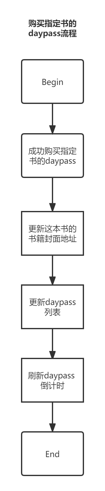
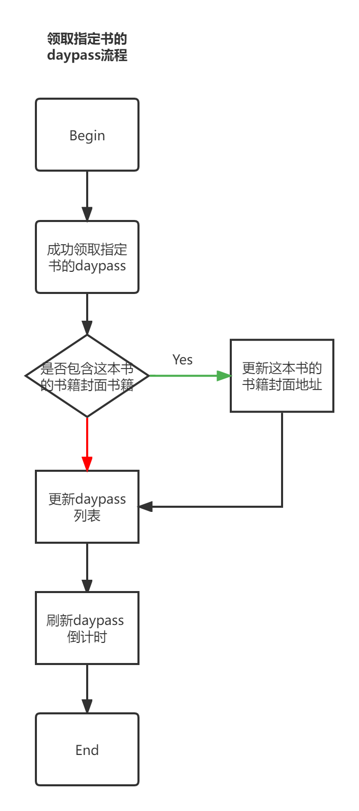
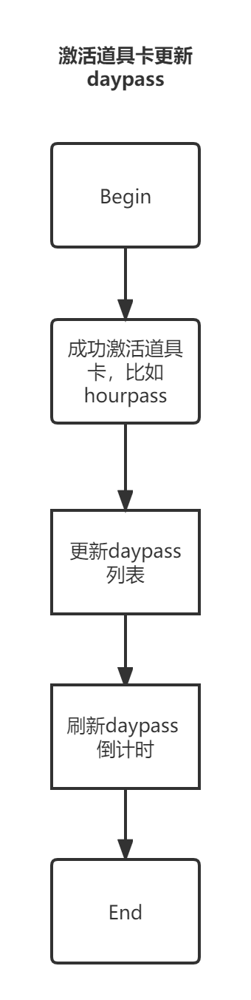

## book's daypass guide
### daypass data operate
    1. 获取daypass 的途径：购买，领取奖励
    2. 更新daypass 的有效期
    3. 更新daypass 的书籍封面地址
### buy book's daypass



ps: 基本不用修改这个流程

### claim book's daypass



ps: 上面的流程，检查是否更新书籍封面及更新daypass列表，请按照业务层的需求，自行处理。
```
//更新书籍封面地址
DayPassManager.Ins.AddDayPassInfo(item.story_id,item.cover,"");

//更新daypass列表有效期
BookLibraryService:UpdateDaypassList(resp.data.add_props.pass_list)
```
### 通过激活道具合并daypass数据



ps:道具卡比如hourpass,daypass 可以激活指定书籍，效果也是在有效期间，免费阅读书籍。