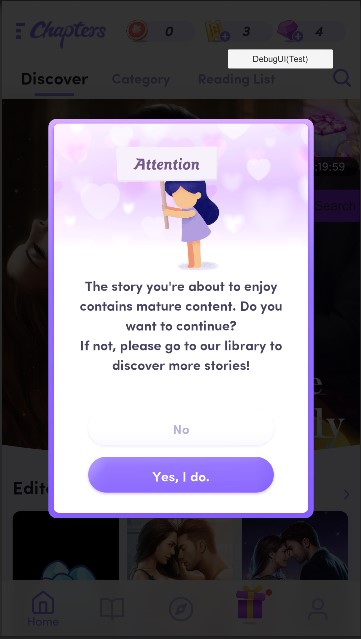
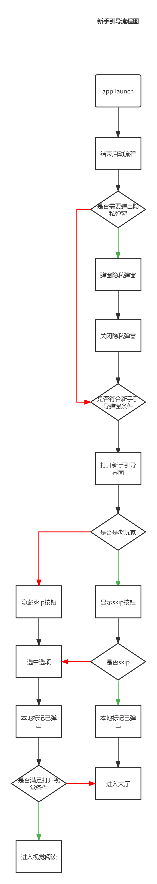

### 新手引导开发文档
#### 准备工作
##### 开关
1. 添加开关
```
is_newbie_guide_condition
值:时间戳
目的:只有注册时间大于等于它的玩家，才符合新手引导的条件.
```
2. 删除开关
```
Discover_Porn_Alter_A
描述:17+ 开关，关掉就不会弹出17+弹窗
```



3. 多语言

```
Key:NewbieGuide/Des (需要新加)
Vlaue: 参考界面描述"Please select an option to start story.."

Key:BubbleGuide/Skip
Value:Skip
```

##### 流程图
