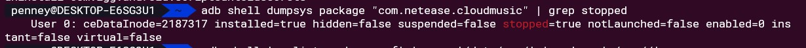

# Adb Usage

## pm

### list all packages
```
adb shell 'pm list packages -f' | grep '/data/app/' | sed -e 's/.*=//'
```

### list all packages and print custom log
```
adb shell 'pm list packages -f' | grep '/data/app/' | sed -e 's/.*=//' | while read comm; do echo "uninstall $comm"; adb uninstall $comm; done;
```

## battery manager
```
adb shell dumpsys package "com.netease.cloudmusic" | grep stopped
```
the result is :


if **stopped** is true , means will not receive in background .