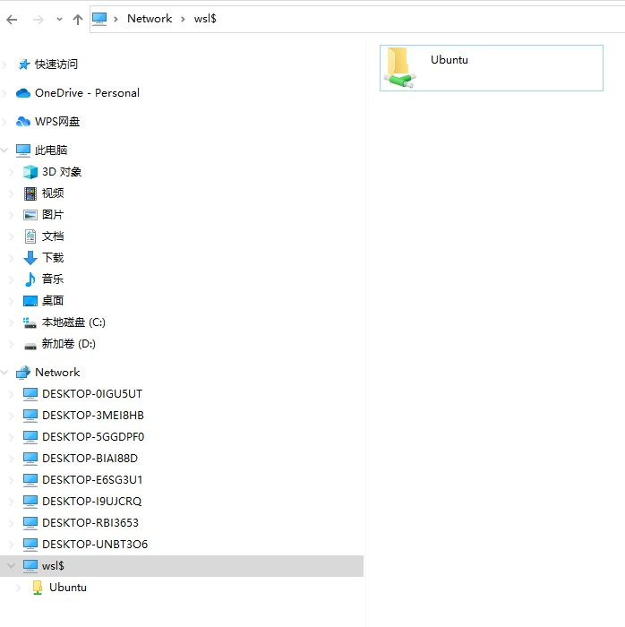

## Step Guide
### find wsl location 

```
\\wsl$
\\wsl$\Ubuntu
```


### run adb.exe from WSL Ubuntu
1. 修改shell配置 
```
export PATH=$PATH:/mnt/d/Sdks/AndroidSdk/platform-tools/

alias adb='/mnt/d/Sdks/AndroidSdk/platform-tools/adb.exe'
```

2. 重启shell 
```
source ~/.bashrc
```
因为我用的是 zsh ，所以会出现下面的错误:

```
/home/penney/.bashrc:16: command not found: shopt
/home/penney/.bashrc:24: command not found: shopt
/home/penney/.bashrc:111: command not found: shopt
/usr/share/bash-completion/bash_completion:45: command not found: shopt
/usr/share/bash-completion/bash_completion:1512: parse error near `|'
```

改为重启zsh

```
source ~/.zshrc
```
